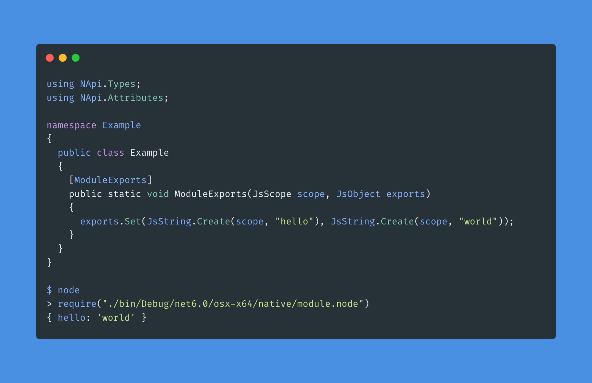

> This project is still in the early stages of development. All code, interfaces and features are unstable.


# napi-cs

> Inspired by [napi-rs](https://github.com/napi-rs/napi-rs).

Experimental tool chain for build NodeJS modules with .NET 6.0 and C#.

`napi-cs` will compile your modules into a native (architecture specific) shared library with [Native AOT](https://github.com/dotnet/runtimelab/tree/feature/NativeAOT), modules can be safely distributed without .NET installation.



## Getting Started

0. Pre-requisites

* The latest version of [.NET 6.0](https://dotnet.microsoft.com/download/dotnet/6.0).
* c++ toolchain in your system, see more detail here [Pre-requisites for Native AOT](https://github.com/dotnet/runtimelab/blob/feature/NativeAOT/docs/using-nativeaot/prerequisites.md)

1. Install Templates

``` bash
$ dotnet new -i NApi.Template
```

2. Create Project

``` bash
$ mkdir foo && cd foo
$ dotnet new nodejs
```

3. Build

``` bash
$ dotnet build
```

4. Test Your Module

``` bash
$ node
> require("./bin/Debug/net6.0/osx-x64/publish/module.node")
```

> PS: Replace `osx-x64` with your operating system 

## Limitations

* Only support x64 Windows, Linux, MacOS.
* [Limitations of Native AOT Runtime](https://github.com/dotnet/runtimelab/blob/feature/NativeAOT/docs/using-nativeaot/limitations.md)

> [TODO] CoreCLR Mode: No above limitations, but it depends on .NET installation at runtime 
